# PyPI Publishing Design

## Goal

Publish VibeSys as one installable PyPI distribution with this user contract:

```bash
uv tool install vibesys
vibesys
```

The installed application must not depend on a repository checkout, editable
workspace packages, a JavaScript package manager, or a system Bun or Node.js
installation. The first release supports interactive use on Linux glibc and
macOS, each on x86_64 and arm64. Windows and Linux musl are outside this
release.

## Distribution ownership

The `vibesys` distribution owns the framework and all framework-internal import
packages:

- `vibesys`
- `vs_feature_flags`
- `vs_github`
- `vs_issue_board`
- `vs_loop_state`
- `vs_sandbox`

The source directories and import boundaries remain separate. Setuptools uses
explicit package discovery across their existing source roots. The five
`libs/*` projects stop being independently installable workspace distributions,
and `vibesys` stops declaring unresolved `vs-*` dependencies. Their transitive
requirements become direct `vibesys` metadata requirements.

`vs_bench` has different ownership. It is an SDK consumed by input projects in
their own environments, not by the framework interpreter. The wheel therefore
bundles the complete installable `sdk/vs-bench` source project under
`vibesys/_sdk/vs-bench`. Workspace materialization copies that project into an
experiment before the input environment installs it. It is not exposed as a
top-level package in the VibeSys tool environment and is not published as a
separate PyPI distribution.

## Bundled resources

The wheel includes the complete tracked contents of:

- `resources/profilers`
- `resources/skills`
- `sdk/vs-bench`, including its `pyproject.toml`, source, and `py.typed`

They are installed under `vibesys/_resources` and `vibesys/_sdk`. Checkout runs
prefer repository files so local edits remain visible. Installed runs resolve
the package copies through `importlib.resources`.

The build excludes Git metadata, Python caches, bytecode, and third-party
repository checkouts under `resources/skills/**/repos`. A release build starts
from a clean Git archive, so untracked local files cannot enter an artifact.
Artifact tests compare all expected tracked paths and contents with the wheel.
Missing required trees are fatal in release mode.

## TUI payload

Each platform wheel contains one self-contained TUI payload:

```text
vibesys/_tui/
  bin/bun
  app/dist/*.js
  app/node_modules/@opentui/...
  app/package.json
  licenses/...
```

The TypeScript client is compiled from the repository lockfile. Bun 1.3.9 is
pinned for the first release, with baseline x86_64 builds used to avoid an
AVX2-only installation contract. A production
deployment contains only runtime dependencies for the target platform. The
pinned Bun executable is copied into the payload with its license. The Python
launcher invokes that executable directly and tells the TypeScript launcher to
use the same executable for its frontend children. A system `bun`, `node`,
`npm`, or `pnpm` is neither searched nor required.

The launcher disables Bun's automatic package installation. Missing payload
dependencies therefore fail locally instead of causing network access or
resolving a version that differs from the release lockfile.

The payload is a directory rather than one compiled executable. This preserves
OpenTUI's native-library loading model, avoids embedding multiple Bun runtimes
for the launcher and frontend entry points, and keeps the JavaScript build
inspectable. The installed behavior is still self-contained.

Normal editable installs and local headless wheels do not build the TUI. A
dedicated release command prepares the payload before invoking the Python wheel
builder. Release mode fails if the payload, runtime version, architecture, or
required frontend files do not match the requested wheel target. This removes
network access and package-manager mutation from setuptools itself.

## Wheel matrix

The release produces exactly four native wheels:

- Linux glibc x86_64
- Linux glibc arm64
- macOS x86_64
- macOS arm64

The Python code has no CPython ABI dependency. The release tags are
`py3-none-manylinux_2_28_x86_64`, `py3-none-manylinux_2_28_aarch64`,
`py3-none-macosx_13_0_x86_64`, and `py3-none-macosx_13_0_arm64`. Build-time
inspection verifies that the embedded binaries meet those baselines.

The initial PyPI release is wheel-only. Uploading a root source distribution
would let installers on unsupported platforms silently build a headless wheel,
which violates the one-line interactive-install contract. Source builds remain
available from the repository and are tested separately. Adding a published
sdist requires an explicit future policy for obtaining the native TUI payload.

## Build and release flow

```mermaid
flowchart LR
    A["Clean Git checkout"] --> B["Install locked Python and pnpm dependencies"]
    B --> C["Build TypeScript"]
    C --> D["Stage target Bun and OpenTUI payload"]
    D --> E["Build platform-tagged vibesys wheel"]
    E --> F["Static artifact verification"]
    F --> G["Clean-room install and runtime tests"]
    G --> H["Upload immutable CI artifact"]
    H --> I["Trusted Publishing to PyPI"]
```



A pull request runs the four-platform build and verification matrix without
publishing. A GitHub release rebuilds the tagged commit through the same
commands, collects exactly four verified wheels, and publishes them with PyPI
Trusted Publishing. The publishing job has only `id-token: write`, is protected
by a GitHub `pypi` environment, and contains no long-lived PyPI token.

The release workflow validates that the Git tag, Python project version, TUI
package version, wheel metadata version, and filenames agree. It rejects dirty
source, duplicate targets, universal wheels, unexpected archives, and missing
platforms. Upload occurs only after every native job succeeds.

## Runtime path resolution

One resource locator owns checkout-versus-installed resolution for resources
and SDK projects. It returns concrete filesystem paths because profiler scripts,
skill materialization, and input-project installation pass these trees to
subprocesses and sandboxes.

Input SDK dependencies retain their declarative `sdk/...` source paths. The
materializer first accepts a valid checkout-local SDK path. When that checkout
path is unavailable, it maps the normalized suffix beneath `sdk/` to the
packaged SDK root. Paths that escape `sdk/`, reference an unknown bundled
project, or lack `pyproject.toml` remain errors.

## Failure behavior

- Release builds fail instead of producing a wheel without resources, SDK, or
  TUI content.
- Unsupported target identifiers and architecture mismatches fail before wheel
  creation.
- Missing or non-executable bundled Bun produces a direct installation/runtime
  diagnostic. There is no fallback to an arbitrary system runtime.
- Development installs may run headless when no staged TUI exists, preserving
  contributor workflows without weakening release checks.
- Packaged SDK fallback accepts only normalized paths inside the declared SDK
  root.
- Publishing refuses any artifact that was not produced and verified in the
  current workflow run.

## Verification

### Unit and contract tests

- Package discovery includes all six framework import packages and every
  `py.typed` marker.
- Distribution metadata has no `vs-*` requirements and includes the internal
  packages' transitive requirements.
- Resource and SDK locators prefer checkout content and fall back to installed
  content.
- SDK path normalization accepts bundled paths and rejects traversal,
  out-of-root paths, missing projects, and malformed projects.
- TUI staging validates the runtime, production deployment, licenses, and
  target identity without mutating source dependencies.
- Wheel tag selection rejects unsupported or host-mismatched targets.
- Release artifact validation rejects missing, extra, mistagged, or
  version-mismatched files.

### Artifact tests

Each wheel is unpacked and checked against an expected manifest. Tests import
all framework packages from the installed wheel, verify their distribution
owner is `vibesys`, locate every bundled skill/profiler/SDK file, validate
console entry points, inspect native dependency closure, and confirm that only
the requested OpenTUI native package is present.

### Clean-room tests

The Linux x86_64 wheel is additionally tested locally in a two-stage Docker
flow. The runtime image receives only the built wheel, has an empty home and
cache, does not mount the repository, clears Python path and user-site state,
and contains no JavaScript runtime or package manager other than the Bun binary
inside the installed wheel.

Every native CI target performs the equivalent isolated installation. It runs:

- `vibesys --help`
- representative validation and headless commands
- all bundled-package imports
- resource and SDK materialization checks
- `vs_bench` installation and import inside a separate input environment
- a pseudo-terminal TUI smoke test that initializes OpenTUI, exchanges a
  control-protocol request with a deterministic local backend, and exits cleanly

The exact wheel tested is the wheel uploaded by the publishing job.

## Metadata and documentation

Project metadata declares the MIT license, supported Python version, supported
operating systems, repository, issue tracker, and console scripts. The README
leads with `uv tool install vibesys`, lists the four supported targets, explains
required external agent credentials and CLIs, and distinguishes packaged SDK
content from independently published packages.

The release documentation records the one-time PyPI Trusted Publisher setup,
release-tag procedure, release-candidate verification, and recovery behavior.
The npm package remains source/development metadata and is not part of this
release.
